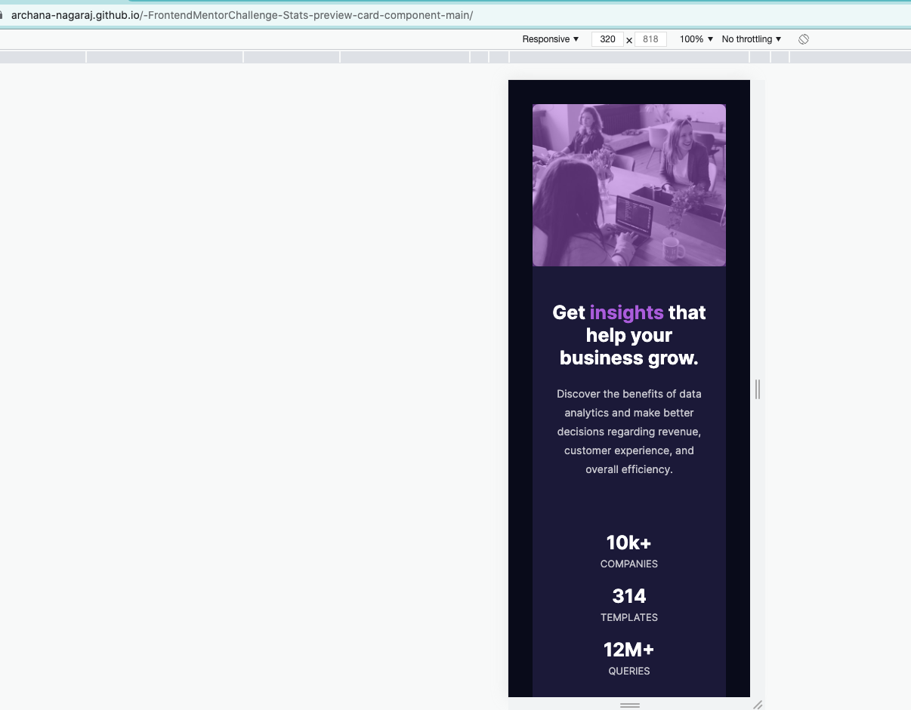
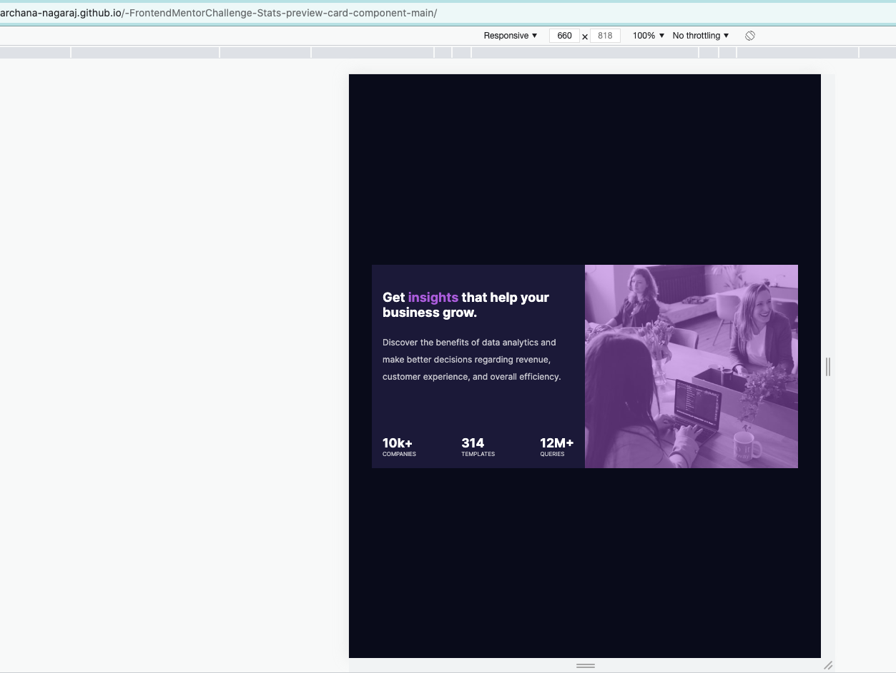
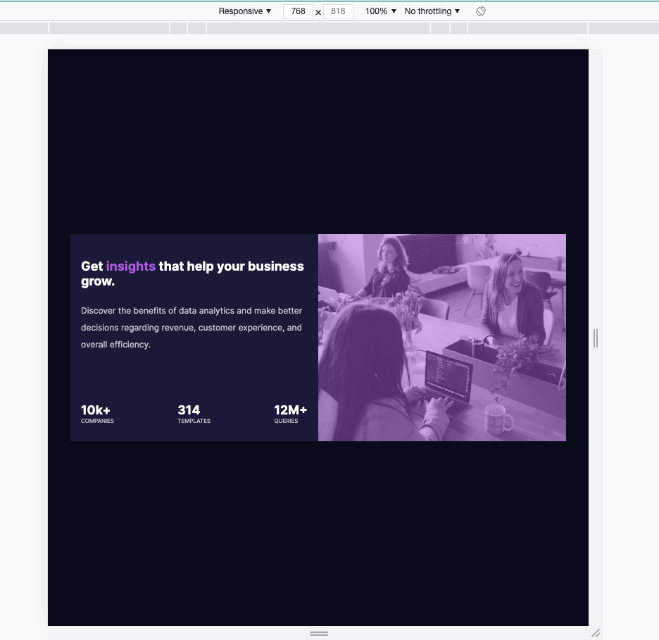
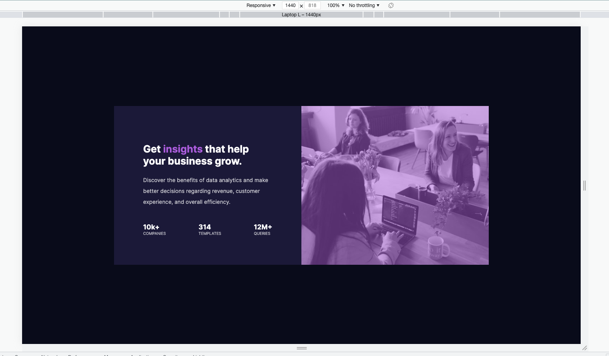

# Frontend Mentor - Stats preview card component solution

This is a solution to the [Stats preview card component challenge on Frontend Mentor](https://www.frontendmentor.io/challenges/stats-preview-card-component-8JqbgoU62). Frontend Mentor challenges help you improve your coding skills by building realistic projects.

## Table of contents

- [Overview](#overview)
  - [The challenge](#the-challenge)
  - [Final Outcome](#final-outcome)
- [My process](#my-process)
  - [Built with](#built-with)
  - [What I learned](#what-i-learned)
- [Author](#author)

## Overview

### The challenge

Your challenge is to build out this card component and get it looking as close to the design as possible.

You can use any tools you like to help you complete the challenge. So if you've got something you'd like to practice, feel free to give it a go.

Your users should be able to:

- View the optimal layout depending on their device's screen size

### Final Outcome

### Links

- Solution URL: [Github Repo](https://github.com/archana-nagaraj/-FrontendMentorChallenge-Stats-preview-card-component-main)
- Live Site URL: [Github Pages](https://archana-nagaraj.github.io/-FrontendMentorChallenge-Stats-preview-card-component-main/)

## My process

### Built with

- HTML
- CSS3
- Flex
- CSS Grid

### What I learned

- More of HTML and CSS properties and its usage
- Learnt about order property in CSS
- Media queries usage

## Author

- Frontend Mentor - [@archana-nagaraj](https://www.frontendmentor.io/profile/archana-nagaraj)
- Github - [@archana-nagaraj](https://github.com/archana-nagaraj)
- Email - [archana.nagaraj](archana.nagaraj@gmail.com)
